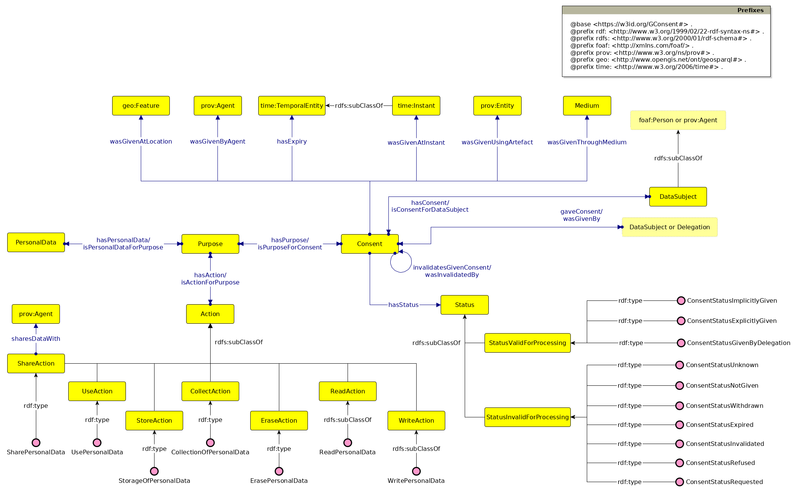

# GConsent
An OWL2 ontology for representing consent for GDPR compliance.
> [https://w3id.org/GConsent](https://w3id.org/GConsent)

Author: [Harshvardhan J. Pandit](https://harshp.com/i/me#HJP) - [ADAPT Centre](https://adaptcentre.ie/) at [Trinity College Dublin](https://tcd.ie/)

Contributor(s):

 * [Pat McBennett](#)
 * [Dave Lewis](https://www.scss.tcd.ie/Dave.Lewis/) -  [ADAPT Centre](https://adaptcentre.ie/) at [Trinity College Dublin](https://tcd.ie/)
 * [Declan O'Sullivan](https://www.scss.tcd.ie/Declan.OSullivan/) -  [ADAPT Centre](https://adaptcentre.ie/) at [Trinity College Dublin](https://tcd.ie/)

The General Data Protection Regulation (GDPR), an European law in effect since 25th May 2018, has explicit consent as one of the lawful basis for processing of personal data. It provides several obligations that govern how consent is obtained and used, and also provides Data Subjects with the right to withdraw their consent. In order to demonstrate compliance with the GDPR, it is essential to record and demonstrate how consent was obtained, used, and changed. The different modeling approaches for representation of consent may use different vocabularies and technologies, but have the common aim of addressing GDPR compliance. Through this work, we analyse the modeling of information associated with consent, and present competency questions that guide the approach for modeling and querying of consent for GDPR compliance. Based on identified requirements, we present the GConsent ontology for consent representation based on the GDPR.

